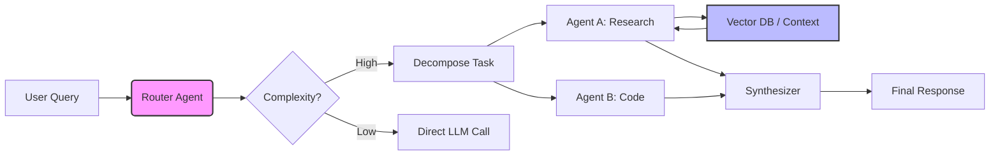

<!-- HEADER SECTION: The "Hero" Banner -->

  
  <!-- Animated Typing Text (Replace 'Your Name' if you want) -->
  

  <!-- Short Bio -->
  

    <b>AI Engineer</b> focused on <b>Large Language Models (LLMs)</b>, <b>Agentic Workflows</b>, and <b>Multi-Agent Orchestration</b>. 
    I bridge the gap between stochastic models and deterministic production systems.
  

  <!-- Social Links with Professional Badges -->
  

    
    
  

<!-- TECH STACK SECTION: Categorized for "Agents" -->
<h2 align="center">🛠️ The Agentic Stack</h2>

  
  <!-- Row 1: Orchestration & Agents -->
  <b>Orchestration & Agents</b> 
  
  
  
  
    

  <!-- Row 2: LLMs & Inference -->
  <b>Inference & Models</b> 
  
  
  
  
    

  <!-- Row 3: Vector Ops & RAG -->
  <b>Vector Ops (Memory)</b> 
  
  
  
    

  <!-- Row 4: Production Engineering -->
  <b>Production Engineering</b> 
  
  
  

 

<!-- ARCHITECTURE DIAGRAM: The "Visual Proof" -->
<!-- This works natively in GitHub dark mode -->
<h2 align="center">🧠 How I Think (System Design)</h2>

Typical RAG Agent Workflow

 

<!-- STATS SECTION: The Stable Versions -->
<h2 align="center">📈 Activity Graph</h2>

  
  <!-- Bottom: The Streak (Using Demolab for stability) -->
  

 

  

